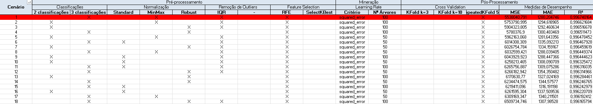

# 🌍 Modelo de Previsão de Enchentes na Amazônia
---
 

## 📈 Sobre o Projeto

Este projeto tem como objetivo a **criação de um modelo de previsão de enchentes na região Amazônica**.

As enchentes na Amazônia causam impactos severos em comunidades ribeirinhas, cidades pequenas e infraestruturas locais. Devido à dificuldade de realizar ações corretivas no momento em que as enchentes acontecem (devido às barreiras logísticas, às vastas distâncias e à falta de acesso), é crucial que medidas preventivas possam ser tomadas **com antecedência**.

O modelo que estamos desenvolvendo visa fornecer uma previsão antecipada baseada em dados de chuva (pluviometria), vazão dos rios e desmatamento, permitindo:

- Proteger vidas humanas e reduzir danos materiais.
- Auxiliar na logística de evacuações e preparações emergenciais.
- Apoiar órgãos públicos e organizações ambientais no planejamento de ações.
  
## 💚 Nosso compromisso

Este projeto busca **proteger comunidades vulneráveis** e **apoiar a preservação ambiental** através de tecnologia e dados.
  

## 📚 GitHubs Externos Relacionados

Este projeto depende de dois repositórios auxiliares para a coleta e o pré-processamento dos dados:

### 1. Extração de Dados Hidrológicos (API ANA HidroWeb)
- **Repositório**: [API ANA Hidroweb](https://github.com/GabiScof/modelo-previsao-enchentes)
- **Descrição**: Sistema de automação para extrair dados de chuva e vazão dos rios através da API da Agência Nacional de Águas (ANA HidroWeb).
- **Autora**: Gabriela Scofield
  
## 🔄 Conexão entre os Projetos

Este projeto de previsão de enchentes **depende dos dados pré-processados** nos repositórios abaixo. Para treinar e validar o modelo de machine learning, utilizamos como insumos:

- Séries históricas de chuva.
- Séries históricas de vazão dos principais rios da região Amazônica.
- Dados de desmatamento

Dessa forma, garantimos que o modelo esteja baseado em dados confiáveis e representativos da realidade hidrológica da Amazônia.
  

## Relatório 
 
 Para facilitar a compreensão do projeto, foi elaborado um relatório detalhado contendo a explicação dos dados utilizados, o motivo da escolha de determinadas funções, além da apresentação de gráficos e análises que ajudam a entender o comportamento das variáveis. O documento serve como base para justificar as etapas de pré-processamento, modelagem e visualização dos resultados.
 
 📄 [Clique aqui para acessar o relatório em PDF](docs/Relatorio-Projeto-Ciencia-de-Dados.pdf)

  
## Plano de Experimentação

Neste projeto, desenvolvemos um plano de experimentação para comparar o desempenho de dois modelos de regressão amplamente utilizados: **Random Forest Regressor** e **XGBoost Regressor**. 

O objetivo foi identificar a melhor combinação de técnicas de pré-processamento, seleção de atributos e estratégias de validação cruzada, a fim de obter o modelo mais robusto e preciso para a tarefa de previsão.

Diversos cenários foram testados, variando:

- Técnicas de normalização (`StandardScaler`, `MinMaxScaler`, `RobustScaler`)
- Estratégias de validação cruzada (`KFold`, `RepeatedKFold`)
- Métodos de seleção de atributos (`RFE`, `SelectKBest`)
- Hiperparâmetros dos modelos (como profundidade das árvores e taxa de aprendizado)

As métricas utilizadas para avaliação dos modelos foram:

- **R²** (coeficiente de determinação)
- **MSE** (Erro Quadrático Médio)
- **MAE** (Erro Absoluto Médio)

Todos os resultados foram registrados em uma planilha que contém a combinação de parâmetros testados, permitindo identificar os melhores cenários.

📄 [Download do Plano de Experimentação (.xlsx)](./docs/Plano-de-Experimentação.xlsx)
  

📊 Abaixo, uma preview do Plano de Experimentação para o Random Forest Regressor:
  

